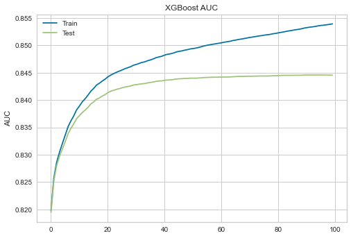

# A Tree-Based Model for Predicting Travel Mode

<style>
page-header {
  background-image: url('images/headerbackground.jpeg');
  background-repeat: no-repeat;
  background-attachment: fixed;
  background-size: 100% 100%;
}
</style>


## Introduction

In a previous study, Deloitte Consulting LLP developed a method of creating city simulations through cellular location and geospatial data. Using these simulations of human activity and traffic patterns, better decisions can be made regarding modes of transportation or road construction. However, the current commonly used method of estimating transportation mode choice is a utility model that involves many features and coefficients that may not necessarily be important but still make the model more complex. Our goal is to use a tree-based approach - in particular, XGBoost - to identify just the features that are important for determining mode choice so that we can create a model that is simpler, robust, and easily deployable. By the end of the quarter, we plan to have a working model to predict mode choice and a written paper to report our results and analyses. 

## Hypothesis

## Data
The datasets we use consists of two dataframes: trips and utilityvars. The first dataframe, trips comes from a csv that previously predicted the travel mode choice each activity took, linked to activity and person IDs.

The utilityvars data provides us information about each unique trip, to predict the target trip mode. We plotted some of the variables to get insight into the distributions of our data and the activities we have. 

The targettripmode has 12 different trip modes, and its distribution is shown in the figure below. The modes range from 1 to 12, and the most common trip modes are 1, 3, and 5, which are Drive Alone Free, HOV2 Free, HOV3 Free. The least common trip modes are 6, 10, 4: HOV3 Pay, Park and Ride, HOV2 Pay. This shows that most travelling is done through driving and without paying. In most cases, it is rare that people pay when driving. 


Another variable we plotted a histogram of is age. Most activities consist of people of age groups categorized as 4, 6, 7, which are people of ages 25 and above, with more of the older age range. The gap we see between 5 to 6 is because our data on age does not have the category of 5. 


Another descriptive variable we have is of income. The income group 3 is the highest, which has the average income of $60k to $100k. The lowest group for income is group 4, which is the average income of $100k to $150k. Most households in our dataset have an income that is around average, and in general, of lower income groups. Income subpopulations can be interpreted in our model because this can affect travel modes. 


## Techniques 

### XGBoost

### Bayesian Optimizer

## XGBoost Model Implementation 

## Results 

### Evaluation 

After we finished the model, we created a validation pipeline to estimate the performance of our model and sought the potential problems in our model, like overfitting or imbalanced sample. For measurement of correctness, we referred to evaluation metrics such as accuracy, sensitivity, F1-score. The feedback indicates that our model did a great job on the sample data, but also causes a great deal of concern. In the next weeks, we would diagnose the problem and adjust our model accordingly.  
  
Below are the AUC curves for the training and testing sets over 100 epochs. We observe that the training curve improves steadily while the testing curve plateaus at an AUC of around 0.91, which means our model correctly predicts about 91\% of the test set. 



We also plotted ROC curves for each class using the One vs All technique, which considers one class as a label and groups the others as the other label. This way, we can see which classes our model tends to perform better on. According to the AUC scores, we see that our model does best predicting school bus and drive alone paid trips, but not as well on 2-person HOV free trips. 


### Feature Fine-tuning

To simplify our model, we want to use only a handful of features. We narrowed down our choices by evaluating the feature importances, which indicates how important each feature was in building the model. Based on the graph below, we observed that employment density at the origin and destination regions (dempden, oempden) were the two most important features in determining trip mode. We intend to use all the features as or more important than the single occupancy vehicle cost (sovcost) in our optimized mode. 


## Appendix 

```markdown
Syntax highlighted code block

# Header 1
## Header 2
### Header 3

- Bulleted
- List

1. Numbered
2. List

**Bold** and _Italic_ and `Code` text

[Link](url) and 
```

For more details see [Basic writing and formatting syntax](https://docs.github.com/en/github/writing-on-github/getting-started-with-writing-and-formatting-on-github/basic-writing-and-formatting-syntax).

### Jekyll Themes

Your Pages site will use the layout and styles from the Jekyll theme you have selected in your [repository settings](https://github.com/lkuwahara/DSC180B.github.io-B05/settings/pages). The name of this theme is saved in the Jekyll `_config.yml` configuration file.

### Support or Contact

Having trouble with Pages? Check out our [documentation](https://docs.github.com/categories/github-pages-basics/) or [contact support](https://support.github.com/contact) and we’ll help you sort it out.
