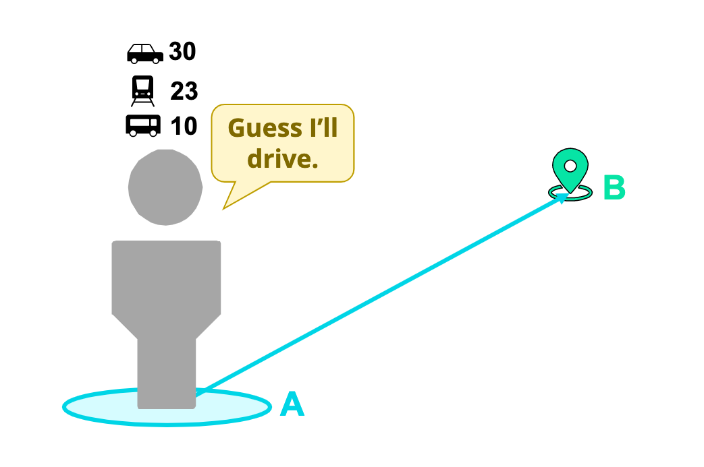

# A Tree-Based Model for Predicting Travel Mode

## Travel Models Support Informed Decision Making
- How will the transportation system perform 30 years into the future?
- Where should a trolley be built to help the most people?
- How will economic, demographic, or land use changes affect transportation system performance?

A travel model can help answer these questions, and many more! 

## The Utility Travel Model 
Idea: A commuter will choose the travel mode that maximizes their welfare 

Assumption: The commuter is fully informed of each mode's attributes and considers all modes equally

Other concerns: Can become very complex, takes a long time to run, and difficult to explain results

## Our Approach: Decision Tree Travel Model
Idea: Based on the travel mode that other commuters chose, we predict a commuter with similar conditions will choose the same mode. 

### XGBoost (Extreme Gradient Boost) Tree: An Optimized Decision Tree
Features:
- Learns from previous decision trees to make better predictions
- Built-in parameters for complexity and overfitting
- Faster than other classifiers

## Data
Our data was provided by our industry mentors, Deloitte Consulting LLP.

The data contains over 14 million different trips with 29 attributes of each trip. We plotted some of the attributes to get insight into the distributions of our data and the activities we have. 

### Trip Modes
We have 12 different trip modes to predict and the distribution is shown in the figure below. The most common trip modes are 1, 3, and 5, which are Drive Alone Free, HOV2 Free, HOV3 Free, meaning most trips were done through driving and without paying tolls or fees.

### Age
Most commuters were in the age groups 4, 6, and 7 which correspond to 25-40, 41-55, and 56+ years old. The gap we see between 5 to 6 is because our data on age does not have the category of 5. 

### Income 
Most commuters fall under the average income of $60k to $100k (Group 3). The least represented group is 4, which is the average income of $100k to $150k. Most households in our dataset have an income that is around average, and in general, of lower income groups. Income subpopulations can be interpreted in our model because this can affect travel modes. 

## Results 

### Evaluation 

After we finished the model, we created a validation pipeline to estimate the performance of our model and sought the potential problems in our model, like overfitting or imbalanced sample. 
  
Below are the AUC curves for the training and testing sets over 100 epochs. We observe that the training curve improves steadily while the testing curve plateaus at an AUC of around 0.91, which means our model correctly predicts about 91% of the test set. 

We also plotted ROC curves for each class using the One vs All technique, which considers one class as a label and groups the others as the other label. This way, we can see which classes our model tends to perform better on. According to the AUC scores, we see that our model does best predicting school bus and drive alone paid trips, but not as well on 2-person HOV free trips. 

### Feature Fine-tuning

To simplify our model, we want to use only a handful of features. We narrowed down our choices by evaluating the feature importances, which indicates how important each feature was in building the model. Based on the graph below, we observed that employment density at the origin and destination regions (dempden, oempden) were the two most important features in determining trip mode. We intend to use all the features as or more important than the parkingcost in our optimized mode. 

We compared the evaluation metrics of our model with the results that Deloitte Consulting LLC provided us from their utility model. For measurement of correctness, we referred to accuracy, sensitivity, precision, and F1-score for evaluation metrics

Accuracy:
- Utility: 48%
- XGBoost: 61%

Sensitivity:
- Utility: 19%
- XGBoost: 29%

Precision:
- Utility: 20%
- XGBoost: 39%

F1-score:
- Utility: 20%
- XGBoost: 33%

## Conclusion

The results show that the XGBoost decision tree model performed better than the utility model across all evaluation metrics. We hope that as the model becomes more fine-tuned, we will be able to improve these numbers even more and provide urban planners and policy makers with accurate simulations that will assist them in making more informed decisions. 